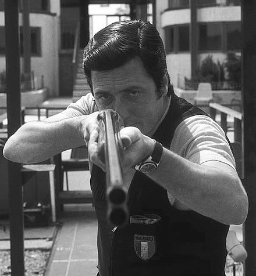
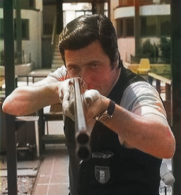
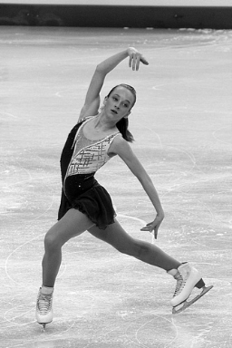
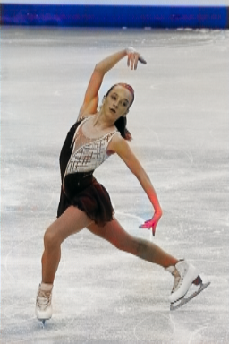

[](http://hits.dwyl.io/srihari-humbarwadi/image_colorization_gan_tf20)

A TensorFlow 2.0 implementation of the paper with title [Image Colorization with Generative Adversarial Networks](https://arxiv.org/abs/1803.05400)

### Results
 

 

 

 

 

 


### Training on your own dataset
Assuming your dataset has the following directory structure, an example training config is given below.
For multi GPU and multi node distributed training change the distribution strategy in the config accordingly.
```
'''
train
├── 0004a4c0-d4dff0ad.jpg
├── 00054602-3bf57337.jpg
├── 00067cfb-e535423e.jpg
├── 00091078-59817bb0.jpg
├── 0010bf16-a457685b.jpg
├── 001b428f-059bac33.jpg
...
'''
config = {
    'distribute_strategy': tf.distribute.OneDeviceStrategy(device='/gpu:0'),
    'epochs': 100,
    'batch_size': 32,
    'd_lr': 3e-5,
    'g_lr': 3e-4,
    'image_list': glob('train/*'),
    'model_dir': 'model_files',
    'tensorboard_log_dir': 'logs',
    'checkpoint_prefix': 'ckpt',
    'restore_parameters': False
}
```

## To-Do
 - [x] Build Dataset
 - [ ] Preprocessing function: write color conversion with tensorflow ops
 - [x] Log metrics to Tensorboard
 - [x] Compute PSNR
 - [x] Inference function
 - [ ] TPU Compability
